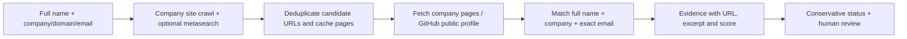

# Deep Web Search Tools

Evidence-first **public professional identity search** for validating a supplied contact in an outbound workflow. The name is a project label: this tool searches the public web, not private accounts or the dark web. It cannot authenticate a person, prove mailbox ownership, or guarantee that a public profile belongs to the supplied person.

## What works

- Keyless company-site discovery from public homepage links and sitemaps, respecting `robots.txt` and bounded to ten candidate pages.
- Name-only candidate search when a broad provider is configured, with explicit `Chaubey`/`Choubey` variants. A name-only result stays `possible` and cannot release an outbound contact.
- Bounded first-party PDF reading for official faculty CVs and documents. A shortened name can be linked to a surname in a nearby institutional email on the same profile document; that evidence is labeled separately from a full-name match.
- Self-hosted SearXNG for broader web candidates in Docker, with no commercial search API key; 24-hour local site/page/search cache.
- Optional Brave Search API adapter for teams that choose a paid provider. Broad search uses at most three queries per contact.
- GitHub public user API checks for a candidate profile's public name, company and email.
- Institution-listed LinkedIn and Facebook accounts can support a match when an indexed post names the person. Each account has a reviewed proof URL on the institution's own domain.
- Deterministic evidence score and one of four statuses: `corroborated`, `supported`, `possible`, `unresolved`.
- Source URLs, excerpts, query list, warnings and a local 30-day research log.
- A fictional offline demo and a browser dashboard.

The status describes **public evidence strength**, not identity authentication. Only a first-party page or document plus an independent public GitHub profile can currently produce `corroborated`. A single first-party page or document, or an indexed post from an institution-listed social account, can produce `supported`. The latter is still search-index evidence; a reviewer should open the post before using it for outbound. Unlisted social accounts and generic search snippets stay `possible` at best.

## Quick start

```powershell
cd deep-web-search-tools
python -m venv .venv
.\.venv\Scripts\Activate.ps1
pip install -e ".[dev]"
Copy-Item .env.example .env
python -m uvicorn deepsearch.api:app --host 127.0.0.1 --port 8088
```

Open **http://127.0.0.1:8088**. A real search with a supplied company domain now works without a key by checking that company's public pages. The fictional demo remains separate. Run Docker Compose to add the bundled private SearXNG instance for broader web search. `GITHUB_TOKEN` is optional; unauthenticated GitHub API use has a much lower rate limit.

API example:

```powershell
$body = @{name="Dario Amodei";company="Anthropic";company_domain="anthropic.com"} | ConvertTo-Json
Invoke-RestMethod -Method Post -Uri http://127.0.0.1:8088/api/search -ContentType application/json -Body $body
```

For Docker, copy the env file and run `docker compose up --build`; the dashboard is at the same URL. The bundled SearXNG service enables JSON search inside the private Compose network. Runs and cache persist in the `search_data` volume. Run `python -m pytest -q` for the offline tests.

## How it checks a person



A full-name match with another company stays unresolved. A search result or profile snippet is only a lead. An institution-linked social post can support an affiliation without a student directory: the institution's own site or document must list the account, and the post URL must identify that account. The crawler reads LinkedIn company and Facebook page links from the institution homepage; account approvals backed by other official documents live in `deepsearch/official_accounts.json`. Instagram `/p/` URLs do not identify the publishing account, so Instagram snippets are shown as candidates only. The tool respects source robots rules and does not fetch blocked social posts directly. A company page or social post could be stale or wrong. A publicly listed work email still does not prove that a mailbox exists or is controlled by the named person. Reports keep uncertainty and provider failures visible; zero results do not mean the person does not exist.

Some official PDFs contain only scanned images and have no extractable text. They stay unverified until OCR or human review. A local run without SearXNG or Brave cannot discover unknown organizations from a name alone. The bundled SearXNG service supplies broad discovery in Docker; its upstream engines may still block or throttle queries.

## Upstream project review

| Project | What was useful | Why the repositories were not copied together |
| --- | --- | --- |
| [Digger](https://github.com/d3vn0mi/digger) | Python connector layout and parallel source orchestration | Its Google connector parses search-result HTML, which is brittle; README says MIT, but GitHub did not expose a license file in the checked tree. |
| [OpenOSINT](https://github.com/OpenOSINT/OpenOSINT) | Pluggable tools and evidence-oriented search | MIT licensed; `search_footprint` requires a Bright Data API key/zone. Broad breach/phone/security tools do not establish outbound professional identity. |
| [OSINT-APP](https://github.com/kingsleyweb-tech/OSINT-APP) | Name disambiguation and visible evidence/audit UI | Its deep name search documents roughly 8–11 SerpApi calls per person and the checked tree has no license file. |

This is **original implementation** combining the applicable ideas, not a fork or code bundle. [SearXNG's JSON search API](https://docs.searxng.org/dev/search_api.html) is the bundled broad-search path; [Brave's API](https://api-dashboard.search.brave.com/documentation/guides/authentication) is optional. [GitHub's public user API](https://docs.github.com/en/rest/users/users) enriches discovered public profiles.

## Capacity and current limits

At 1,500 contacts/day and three uncached broad queries each, plan for up to **4,500 metasearch requests/day** plus company-page and GitHub checks. Self-hosting SearXNG removes a commercial API-key dependency but **does not remove upstream rate limits, bot blocks or infrastructure cost**. This project uses a private SearXNG instance because many public instances [disable JSON](https://docs.searxng.org/dev/search_api.html). The company crawl stays useful if metasearch is unavailable. GitHub's [unauthenticated REST limit is 60 requests/hour per IP](https://docs.github.com/en/rest/using-the-rest-api/rate-limits-for-the-rest-api). Cache, source pacing, backoff, load measurement and a shared quota are needed before claiming 1,000+ reliable researched contacts/day.

Current storage is SQLite for a local research tool. Before cloud deployment add authentication/RBAC, managed PostgreSQL, a distributed queue/quota, source terms/robots review, retention controls and a measured load test. Do not expose this dashboard publicly with an empty `APP_API_KEY`. The dashboard is intended for localhost; `APP_API_KEY` protects API calls when set, but a production UI needs real user login and authorization.

This tool intentionally does not collect home addresses, family details, breach records, private social posts or other unrelated personal data. It never bypasses a login or CAPTCHA. For sales, a defensible professional match and a source link are more useful than a large mixed dossier.
