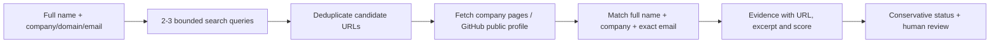

# Deep Web Search Tools

Evidence-first **public professional identity search** for validating a supplied contact in an outbound workflow. The name is a project label: this tool searches the public web, not private accounts or the dark web. It cannot authenticate a person, prove mailbox ownership, or guarantee that a public profile belongs to the supplied person.

## What works

- Full name plus company/domain/work-email search with a maximum of three queries.
- Brave Search API or a configured SearXNG JSON API, with 24-hour local result cache.
- Company-domain page checks for the full name; a small number of candidate pages are fetched.
- GitHub public user API checks for a candidate profile's public name, company and email.
- Deterministic evidence score and one of four statuses: `corroborated`, `supported`, `possible`, `unresolved`.
- Source URLs, excerpts, query list, warnings and a local 30-day research log.
- A fictional offline demo and a browser dashboard.

The status describes **public evidence strength**, not identity authentication. Only a company page plus an independent public GitHub profile can currently produce `corroborated`. A single company page can produce `supported`. Search snippets alone cannot produce either.

## Quick start

```powershell
cd deep-web-search-tools
python -m venv .venv
.\.venv\Scripts\Activate.ps1
pip install -e ".[dev]"
Copy-Item .env.example .env
python -m uvicorn deepsearch.api:app --host 127.0.0.1 --port 8088
```

Open **http://127.0.0.1:8088** and click **Try fictional demo**. Demo results are fabricated and never mixed with real searches. For live search, set `BRAVE_SEARCH_API_KEY` in `.env`, or set `SEARCH_PROVIDER=searxng` and `SEARXNG_URL` to your own instance with JSON enabled. The UI will show when live search is not configured. `GITHUB_TOKEN` is optional for higher GitHub API limits.

API example:

```powershell
$body = @{name="Ada Lovelace";company="Example Utility";company_domain="example.org"} | ConvertTo-Json
Invoke-RestMethod -Method Post -Uri http://127.0.0.1:8088/api/search -ContentType application/json -Body $body
```

For Docker, copy the env file and run `docker compose up --build`; the dashboard is at the same URL. Runs and cache persist in the `search_data` volume. Run `python -m pytest -q` for the offline tests.

## How it checks a person



A full-name match with another company stays unresolved. A search result or profile snippet is only a lead. A company page supports a professional association, but could be stale or wrong. A publicly listed work email still does not prove that a mailbox exists or is controlled by the named person. Reports keep uncertainty and provider failures visible; zero results do not mean the person does not exist.

## Upstream project review

| Project | What was useful | Why the repositories were not copied together |
| --- | --- | --- |
| [Digger](https://github.com/d3vn0mi/digger) | Python connector layout and parallel source orchestration | Its Google connector parses search-result HTML, which is brittle; README says MIT, but GitHub did not expose a license file in the checked tree. |
| [OpenOSINT](https://github.com/OpenOSINT/OpenOSINT) | Pluggable tools and evidence-oriented search | MIT licensed; `search_footprint` requires a Bright Data API key/zone. Broad breach/phone/security tools do not establish outbound professional identity. |
| [OSINT-APP](https://github.com/kingsleyweb-tech/OSINT-APP) | Name disambiguation and visible evidence/audit UI | Its deep name search documents roughly 8–11 SerpApi calls per person and the checked tree has no license file. |

This is **original implementation** combining the applicable ideas, not a fork or code bundle. [Brave's API](https://api-dashboard.search.brave.com/documentation/guides/authentication), [SearXNG's JSON search API](https://docs.searxng.org/dev/search_api.html), and [GitHub's public user API](https://docs.github.com/en/rest/users/users) are the live adapters. Search-provider keys are server-side only.

## Capacity and current limits

At 1,500 contacts/day and three uncached queries each, plan for up to **4,500 web-search requests/day** before company/GitHub checks. Budget against the provider's per-second and monthly quota; Brave returns [rate-limit headers and 429](https://api-dashboard.search.brave.com/documentation/guides/rate-limiting). This local service paces Brave calls within one process and caches repeated queries. Multiple replicas need a **shared Redis quota**, a job queue, cost caps and backoff before bulk use. SearXNG still depends on upstream engines and may disable JSON on public instances; use an owned, configured instance.

Current storage is SQLite for a local research tool. Before cloud deployment add authentication/RBAC, managed PostgreSQL, a distributed queue/quota, source terms/robots review, retention controls and a measured load test. Do not expose this dashboard publicly with an empty `APP_API_KEY`. The dashboard is intended for localhost; `APP_API_KEY` protects API calls when set, but a production UI needs real user login and authorization.

This tool intentionally does not collect home addresses, family details, breach records, private social posts or other unrelated personal data. It never bypasses a login or CAPTCHA. For sales, a defensible professional match and a source link are more useful than a large mixed dossier.
